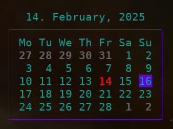

# A command-line calendar

Displays the current month with the current day highlighted.
Similar to `cal`, `ncal`, etc.

<p align="center">
  
</p>

The calendar can be navigated interactively.

<p align="center">
  
</p>

Can also show three months at a time (flag `--three`).

<p align="center">
  
</p>

## tasks

  - [ ] implement a 3-month view which includes the month names on the left (as shown the example below).
  - [ ] provide a flag for colorless output.
  - [ ] do major refactor and clean up complicated function signatures.
  - [ ] make calendar pipeable
    - eg. `selectedDate=$(neocal)`
    - eg. `neocal | (read x; echo "$x")`
  - [ ] give option flag to restrict selection to a list of date ranges.
    - eg. `-restrict '2022-01-01=2022-02-01,2020-01-01=2020-02-01'` only allows selections in Jan 2020 or 2022.
  - [ ] auto-update GUI when next day came.

Later/maybe:

  - [ ] tests for most extreme dates
    - [ ] test for negative years, eg year -1 (do not let user navigate into pre-historic past).
    - [ ] test for 5-digit years, eg year 10000 (do not let user navigate in post-historic future).
  - [ ] have interactive events.
    - [ ] let user associated input forms with certain days of the calendar.
    - [ ] show interactive events on days (eg blue font highlight).
    - [ ] activate interactive events with special key (eg enter/space).
  - [ ] have script events.
    - [ ] let user associated script with certain days of the calendar.
    - [ ] show script events on days (eg blue font highlight).
    - [ ] activate script events with special key (eg enter/space).
    - [ ] run the associated script.

### 3-month view example

The 3-month view could look something like this or similar:

```text
Dec   1  2  3  4  5  6  7
      8  9 10 11 12 13 14
     15 16 17 18 19 20 21
     22 23 24 25 26 27 28
Jan  29 30 31  1  2  3  4
      5  6  7  8  9 10 11
     12 13 14 15 16 17 18
     19 20 21 22 23 24 25
Feb  26 27 28 29 30 31  1
      2  3  4  5  6  7  8
      9 10 11 12 13 14 15
     16 17 18 19 20 21 22
```

## done

  - [X] add 3-month view
  - [X] make main return a date string (format: time.DateOnly, ie '2006-01-02').
  - [X] make the model navigable via vim home row keys (hjkl).
    - [X] go to next month when leaving left or right.

## misc info

For formatting [bubbletea](https://github.com/charmbracelet/bubbletea) and [lipgloss](https://github.com/charmbracelet/lipgloss) were used.
